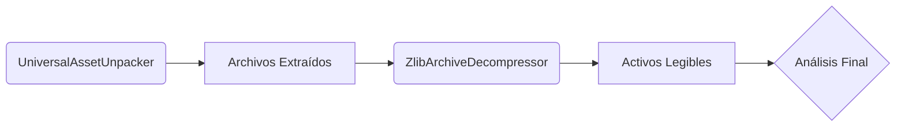

# 🛠️ PE Reversing Utility 
`pe-reversing-util` es una colección de herramientas modulares diseñadas para la auditoría técnica de ejecutables Windows (PE) y la extracción de recursos en contenedores binarios masivos. Este toolkit combina la velocidad nativa de **C++** con la flexibilidad de **Python** para ofrecer un flujo de trabajo de ingeniería inversa optimizado de principio a fin.
##  Pipeline de Extracción y Análisis
El flujo de trabajo estándar para procesar archivos como `.xfs`, `.dat` o binarios empaquetados es:

---

## 🔧 Herramientas Incluidas

| Módulo | Lenguaje | Propósito | Manual |
| :--- | :--- | :--- | :--- |
| **`UniversalAssetUnpacker`** | C++ | Extractor heurístico de alta velocidad basado en patrones. | [Doc](./UniversalAssetUnpacker.md) |
| **`ZlibStreamDecoder`** | Python | Decodificador masivo de flujos Zlib (RFC 1950). | [Doc](./ZlibStreamDecoder.md) |
| **`pe_analyzer`** | Python | Escáner de cabeceras, secciones y entropía de binarios PE. | [Doc](./Readme.md) |

---
## 🚀 Inicio Rápido

### 1. Requisitos
- **Compilador C++**: (MSVC `cl.exe` o `g++`) con soporte para C++17.
- **Python 3.8+**: Instalado y configurado en el PATH.

### 2. Compilación del Extractor Nativo (UAX)
```bash
g++ -O3 UniversalAssetUnpacker.cpp -o UAX.exe -static
```

### 3. Ejemplo de Uso (Workflow Completo)
```powershell
# Paso 1: Extraer activos del contenedor masivo
./UAX.exe input_binary.xfs input_binary.xfs ./output

# Paso 2: Decodificar streams comprimidos en legibles
python ZlibStreamDecoder.py ./output ./final_results
```

---

##  Objetivos del Proyecto
- **Auditoría Técnica:** Identificar estructuras ocultas en binarios x86/x64.
- **Data Mining:** Recuperar activos de juegos y firmwares cerrados.
- **Seguridad:** Analizar empaquetadores y firmas de compresión.

---
